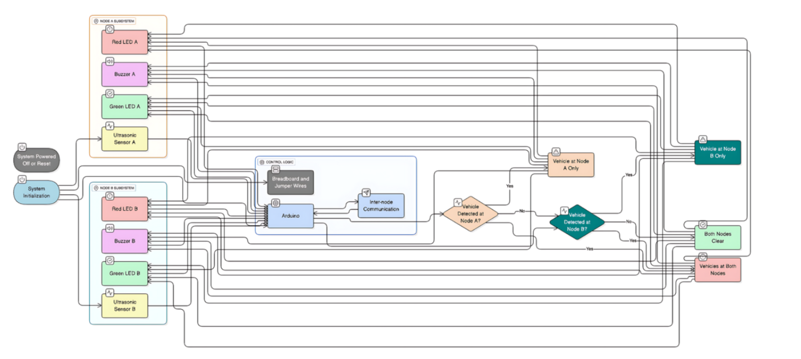
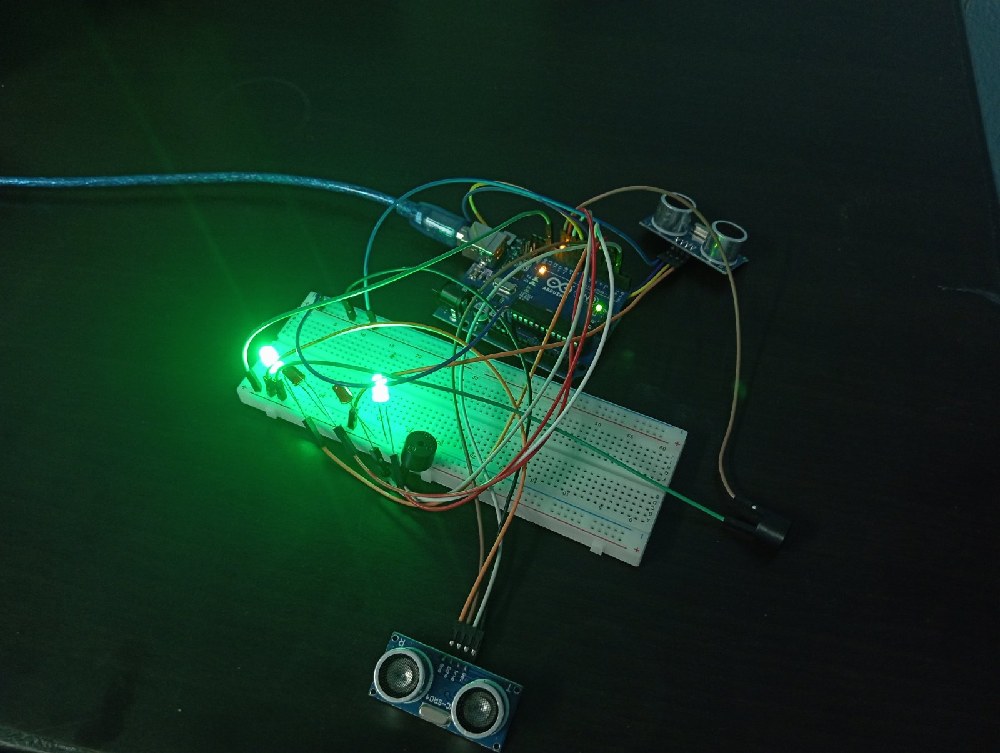
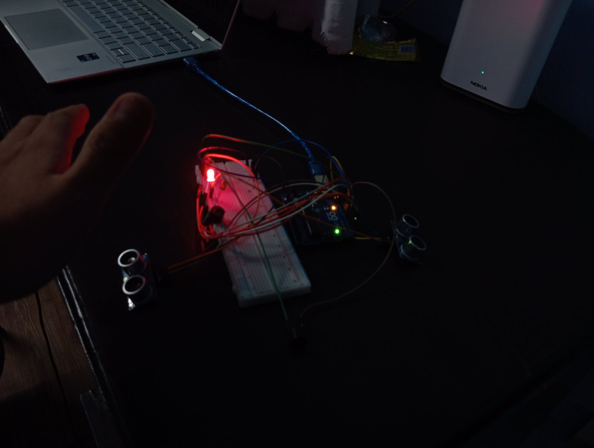
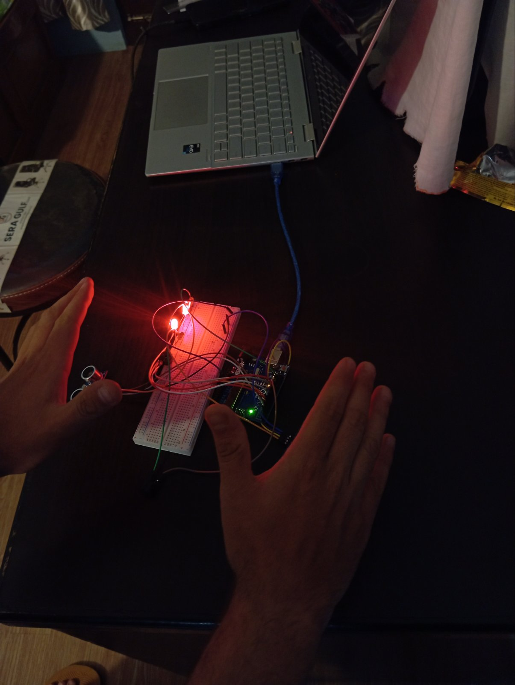
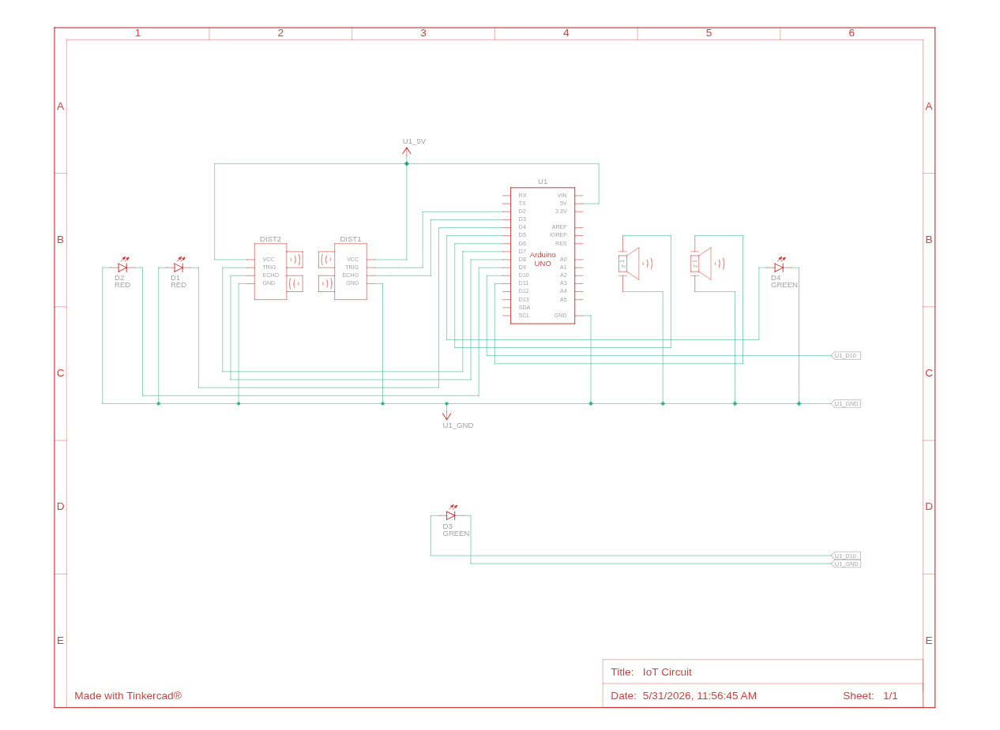
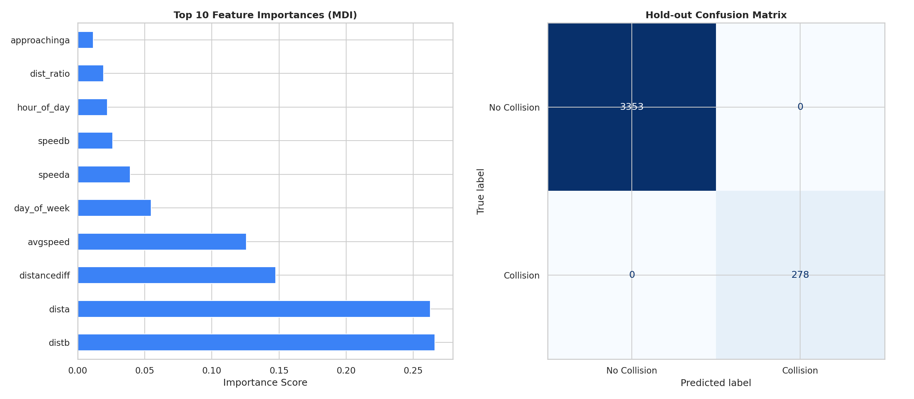
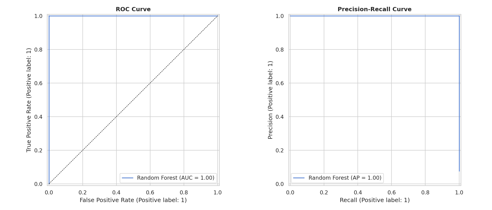

# IoT-Based Blind Curve Collision Detection System

A full-stack IoT collision-risk platform: two roadside Arduino nodes detect vehicles approaching a blind curve and trigger real-time visual/auditory warnings, while a FastAPI + React platform ingests the telemetry, predicts collision risk with a trained Random Forest model, and gives Admins and Policy Makers dashboards to monitor, review, and govern road-safety policy.

Final Year Project — B.Sc. Computer Science and Information Technology, Tribhuvan University, Kathford International College of Engineering and Management.

**Authors:** Aadarsha Pokharel, Ayush Subedi, Rojina Shrestha · **Supervisor:** Mr. Nabin Karki

---

## The problem

Blind curves obstruct a driver's line of sight, making head-on collisions with oncoming vehicles a serious road-safety hazard. Traffic signs and convex mirrors are passive — they depend entirely on human visual perception and reaction time, which are easily compromised by poor visibility, weather, or distraction. This project replaces that passive approach with an active, automated, low-cost early-warning system.

## How it works

Two roadside nodes sit at opposite ends of a blind curve, each with an Arduino, an HC-SR04 ultrasonic sensor, a red/green LED pair, and a buzzer. When a vehicle is detected within the threshold distance at one node, a signal is sent to the opposite node, which switches on its red LED and buzzer to warn the oncoming driver. If vehicles are detected at both ends at once, both nodes go to a high-alert state.


*System overview: each node subsystem (red/green LED, buzzer, ultrasonic sensor) feeds shared control logic over inter-node communication. Vehicle detection at either node drives the system into the correct SAFE / MEDIUM / HIGH alert state.*

| Rule-based state | Trigger | Output |
|---|---|---|
| **SAFE** | No vehicle detected at either node | Green LEDs at both nodes |
| **MEDIUM** | Vehicle detected at one node | Red LED + buzzer at the *opposite* node |
| **HIGH** | Vehicles detected at both nodes simultaneously | Red LEDs + buzzers at both nodes |

### Hardware prototype in action

| No vehicle detected (SAFE) | Vehicle at one end (MEDIUM) | Vehicles at both ends (HIGH) |
|---|---|---|
|  |  |  |
| Both nodes hold steady green — the curve is clear. | One node has flagged a vehicle; the opposite node's red LED + buzzer warn the approaching driver. | Both nodes detect vehicles at the same time — red LEDs and buzzers fire on both ends. |

### Circuit design


*Each node wires an Arduino UNO to two HC-SR04 ultrasonic sensors, red/green LEDs, and a buzzer; the two nodes are cross-connected so a detection on one triggers the actuators on the other.*

---

## System architecture

```
Arduino nodes (HC-SR04, LEDs, buzzer)
        │  serial / CSV
        ▼
iot-pipeline/        ── live or CSV ingestion → MongoDB
        │
        ▼
iot-airflow/          ── Airflow DAGs: MongoDB → Snowflake (Bronze → Silver → Gold)
        │                also trains/retrains the Random Forest risk model on a schedule
        ▼
backend/              ── FastAPI: auth (JWT + Bcrypt), events, predictions, policy
        │                governance, CSV export, audit logging
        ▼
frontend/             ── React + Vite dashboards for Admin and Policy Maker roles
```

- **Retraining:** an Airflow DAG checks every 5 minutes and retrains the model only once at least `MIN_NEW_ROWS_RETRAIN` new telemetry rows have arrived since the last run.
- **Graceful degradation:** if the trained model bundle isn't available, the backend automatically falls back to the deterministic rule-based SAFE/MEDIUM/HIGH logic above, so the platform never goes fully dark.
- **Role-based access:** Admins get platform oversight (user management, audit trail, policy review, CSV export approval); Policy Makers get live monitoring, collision analysis, interactive prediction, and policy drafting.

## Machine learning: collision risk model

A Random Forest classifier (15 features, cost-sensitive class balancing, time-based train/test split) is trained on telemetry engineered from both nodes' distance and speed readings to predict collision risk. It has been through a full end-to-end audit (data quality, leakage, model comparison against 9 other algorithm families, cross-validation strategy, interpretability, and error analysis) — see [`docs/ml_audit/`](docs/ml_audit/) for the complete methodology and findings.


*`distb` and `dista` — the raw distance readings from the two nodes — dominate feature importance, followed by `distancediff`. On a held-out set of 3,631 telemetry events the model produced a perfect confusion matrix: 3,353/3,353 correctly classified as "No Collision" and 278/278 correctly classified as "Collision".*


*ROC-AUC and PR-AUC both reach 1.00 on the clean hold-out set.*

| Scenario | Accuracy | Precision | Recall | F1 | F2 | ROC-AUC |
|---|---|---|---|---|---|---|
| Clean hold-out test set (3,631 events) | 100% | 100% | 100% | 100% | 100% | 1.0000 |
| Simulated real-world sensor noise (Gaussian, σ = 2.5 cm) | 99.86% | 98.6% | 99.6% | 99.1% | 99.4% | 0.9998 |

The noisy-sensor scenario matters more for a real deployment: it re-evaluates the model after injecting Gaussian noise into the distance and speed features to approximate what a physical ultrasonic sensor actually reports outdoors. The decision threshold is tuned by directly **maximizing F2** (recall weighted 4x over precision) against this noisy simulation, not the clean lab data or a fixed recall bar — because in a collision warning system, a missed collision (false negative) is far costlier than an extra cautious warning (false positive). Under noise this yields 4 false positives vs. only 1 false negative out of 3,631 events — the error profile skews the safe direction.

### Training data pipeline — Snowflake-free by design

The original design fed Bronze → Silver → Gold data through Snowflake before training. Since the Snowflake free trial expired (its warehouses were suspended and the Bronze/Silver/Gold tables were lost), training now rebuilds the Gold-equivalent feature table directly from the local CSV (`iot-airflow/dags/tasks/local_features.py`), reusing the *exact same* feature-engineering function (`engineer_features()` in `batch_prediction.py`) that the production scoring path uses at inference time. `fetch_gold_for_training()` in `snowflake_gold.py` automatically falls back to this local builder whenever Snowflake isn't configured or reachable — no manual steps needed to retrain.

This rebuild also fixed a real train/serve skew that existed in the old Snowflake Gold SQL: it recomputed `approachingA`/`approachingB` from `speedA/speedB > 0` instead of passing through the raw Arduino sensor flag, while the production scoring path always used the raw flag. That mismatch affected **16–20% of rows** in the historical dataset.

A follow-up audit (2026-07-16) found and fixed three further issues: (1) `speed_sum` and `closing_velocity` were exact duplicates of `avgspeed` (correlation 1.0000, zero permutation importance) and were dropped, taking the feature count from 17 to 15 with no loss of holdout performance; (2) the decision threshold was being tuned against clean lab data, which let real-world recall silently drift to 93.5% under realistic sensor noise; (3) even after fixing that, the threshold-selection rule itself ("best precision subject to recall ≥ 0.95") left false negatives (11) outnumbering false positives (3) — the wrong direction of error for a safety warning system. The threshold is now chosen by directly maximizing F2 (recall weighted over precision) against the noisy simulation, which recovered recall to 99.6% and flipped the error skew to 4 false positives vs. 1 false negative.

## Tech stack

- **Hardware:** Arduino, HC-SR04 ultrasonic sensors, LEDs, buzzers
- **Backend:** FastAPI, Motor (async MongoDB), scikit-learn, JWT + Bcrypt auth, Cloudinary storage
- **Frontend:** React 18 + Vite, Recharts
- **Data pipeline:** Apache Airflow + PostgreSQL (DAG orchestration), MongoDB (hot telemetry storage), Snowflake (Bronze/Silver/Gold medallion warehouse)
- **ML:** scikit-learn Random Forest, feature engineering + median imputation, scheduled retraining
- **Deployment:** Docker Compose

## Project folders

- `backend/` — FastAPI backend: auth, dashboard APIs, prediction APIs, policy governance, CSV export, audit logging.
- `frontend/` — React app for Admin and Policy Maker workflows.
- `iot-airflow/` — Airflow DAGs for telemetry ingestion, Snowflake medallion processing, and ML training/retraining.
- `iot-pipeline/` — Local/live ingestion scripts from serial (Arduino) or CSV into MongoDB.
- `hardware/` — Circuit reference images and hardware prototype photos.
- `docs/` — Supporting documentation, diagrams, and report material (see below).
- `data/` — Local datasets used for testing and analysis.
- `scripts/` — Convenience scripts (`run-all.sh`) to bring the whole stack up in one terminal.

## Getting started

### Option A — Docker Compose (everything containerized)

From the project root, one command:

```bash
docker compose up -d
```

This builds and starts **frontend, backend, and Airflow + Postgres** together:

- Frontend: `http://127.0.0.1:5173`
- Backend API: `http://127.0.0.1:8000/docs`
- Airflow UI: `http://127.0.0.1:8080`

Both `backend` and `frontend` bind-mount their source directories, so code edits hot-reload the same as running them natively (`uvicorn --reload`, Vite HMR).

**Deliberately excluded by default:** the live Arduino serial ingestion (`serial-logger`, the in-repo equivalent of `iot-pipeline/`) is profile-gated — it needs a real `/dev/ttyACM0` device, which isn't available in a typical dev environment. Start it explicitly only when a board is actually plugged in:

```bash
docker compose --profile serial up -d
```

`iot-pipeline/` itself (the standalone Python ingestion scripts) is never part of `docker compose up -d` — run it manually per `iot-pipeline/README.md` if you need it.

Stop everything: `docker compose down`.

### Option B — Native hybrid (run-all.sh)

From the project root, one terminal:

```bash
./scripts/run-all.sh
```

This starts:

- **Docker**: Airflow + Postgres only (via the same root `docker-compose.yml`, but scoped to just those services — backend/frontend run natively below instead, to avoid port collisions with their containerized counterparts).
- **Backend**: FastAPI on `http://127.0.0.1:8000` (native, `backend/venv`)
- **Frontend**: Vite on `http://127.0.0.1:5173` (native, `npm run dev`)

**Prerequisites:** Docker running, `backend/venv` installed, `frontend` has `npm install` done.

**Stop:** `Ctrl+C` stops backend + frontend and runs `docker compose down` for the Airflow/Postgres services.

**Port 8000 already in use:** Another `uvicorn` (or old run) is still bound. Either stop it, or start everything with:

```bash
RUN_ALL_FREE_PORTS=1 ./scripts/run-all.sh
```

That tries to free ports `8000` and `5173` before starting. You can also run `ss -ltnp '( sport = :8000 )'` and `kill <pid>` manually.

- Keep Docker running after exit: `RUN_ALL_DOCKER_DOWN=0 ./scripts/run-all.sh`
- Also start **live Arduino pipeline** (needs USB + `iot-pipeline` venv optional):

  ```bash
  RUN_PIPELINE=1 SERIAL_PORT=/dev/ttyACM1 ./scripts/run-all.sh
  ```

### Option C — Fully manual (separate terminals)

1. Start backend:
   - `cd backend`
   - `./venv/bin/python -m uvicorn app.main:app --host 127.0.0.1 --port 8000`
2. Start frontend:
   - `cd frontend`
   - `npm run dev`
3. (Optional) Start ingestion/training stack:
   - `docker compose up -d postgres airflow-init airflow-webserver airflow-scheduler` (Airflow only; no USB serial required)
   - To log from Arduino over USB when `/dev/ttyACM0` exists: `docker compose --profile serial up -d`
   - Or run `iot-pipeline/`'s scripts manually — see `iot-pipeline/README.md`
4. Open:
   - Frontend: `http://127.0.0.1:5173`
   - API docs: `http://127.0.0.1:8000/docs`

### Environment variables

Copy `.env.example` to `.env` and fill in your own values — MongoDB Atlas connection string, Snowflake credentials, email notification settings, model/CSV paths, serial port, and a secret key for JWT signing. **Never commit `.env`** — it's already covered by `.gitignore`.

## Notes

- Keep backend `.env` configured (`MONGO_URI`, `MONGO_DB`, `SECRET_KEY`, `MODEL_PATH`).
- Current frontend API base should point to `http://127.0.0.1:8000`.
- Airflow retraining is scheduled every 5 minutes, but actual retrain happens only if new rows since last model >= `MIN_NEW_ROWS_RETRAIN`.

## Why, where, hardware prototype, and product roadmap

For a report-ready explanation of **why** this platform exists, **where** it can deploy, how the **HC-SR04 + LEDs + buzzers** breadboard prototype supports a successful demo, **firmware logic** in words (no embedded source), and **future product** refinement, see:

- [`docs/PROTOTYPE_AND_PRODUCT.md`](docs/PROTOTYPE_AND_PRODUCT.md)

## Future work

- Real-world field testing on actual blind curves under varied weather and traffic conditions
- Replace wired inter-node signaling with LoRaWAN or cellular wireless communication
- Upgrade sensing with radar (AWR1834) or LIDAR, with a Raspberry Pi 4 for edge processing
- Explore Edge AI, TinyML, and RNN/LSTM models for faster, more accurate real-time prediction
- Scale to multi-node, multi-administrator deployment across rural and hilly road networks
